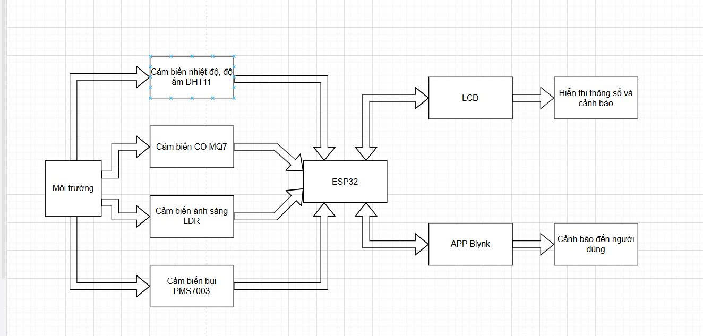
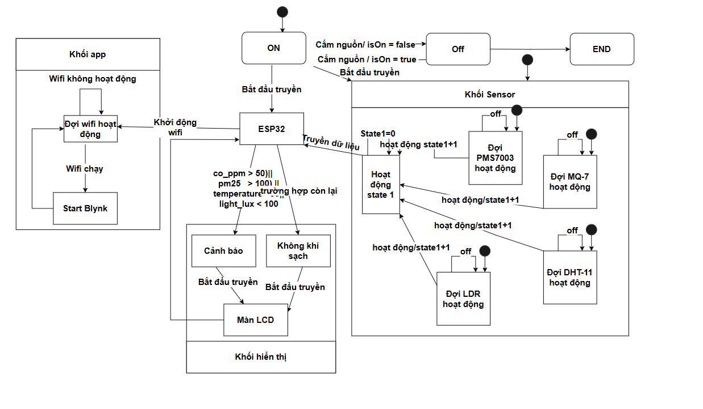

# Kết quả đo: https://docs.google.com/spreadsheets/d/1qLpMMgOfmVTGaLHnQxtyAKnJXiubeZqU/edit?gid=1944139552#gid=1944139552

# Hệ thống có chức năng đo lường và đánh giá chất lượng không khí trong môi trường thông qua các cảm biến như: cảm biến bụi (PMS7003), cảm biến khí CO (MQ-7), cảm biến ánh sáng (LDR) và cảm biến nhiệt độ, độ ẩm (DHT11). Việc xử lý, hiển thị và cảnh báo được thực hiện bởi vi điều khiển ESP32 kết nối với LCD và App Blynk qua WiFi.

	
| Thiết bị            | Chân Thiết Bị   | Kết nối đến Chân ESP32  |
|---------------------|----------------|--------------------------|
| **MQ7**             | A0             | D36 (VP)                 |
| **LDR**             | A0             | D39 (VN)                 |
| **DHT11**           | DATA           | D15                      |             
| **PMS7003**         | TX             | D16 (RX2)                |
|                     | RX             | D17 (TX2)                |         
| **I2C LCD Module**  | SDA            | D21                      |
|                     | SCL            | D22                      |
| **Nguồn (Jack DC)** | VIN            | 5V input (Jack DC)       |

